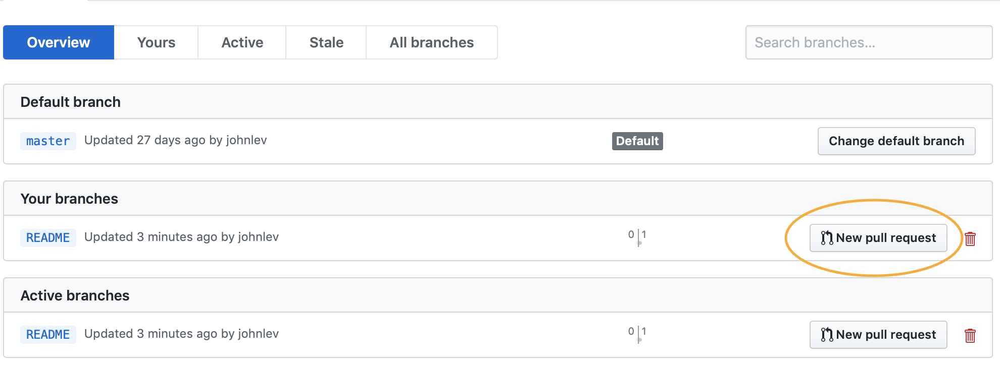
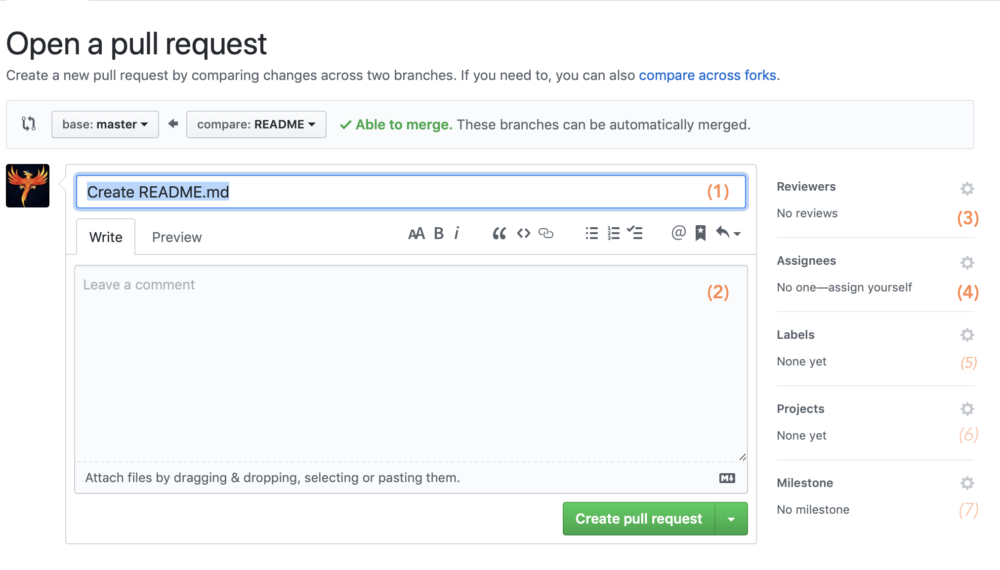

<!--
Author: John Kotz
Created: 4/30/19
-->

# Git Flow

Ever run into this problem when pulling from `master`?

```
Auto-merging file.c
CONFLICT (content): Merge conflict file.c
Automatic merge failed; fix conflicts and then commit the result
```

This is a merge conflict, and they can be super messy to resolve and will clutter your work. You can do some work to resolve this, but in general, wouldn't it be nice if there were a way of interacting with Git such that those kind of **conflicts** are **minimized**?

Have you ever pushed code that's not quite working yet? Has a someone tried to get the code off master and found that it *doesn't work*?! Of course you should commit that not yet complete code, but we also want the version of code people will pull be something that works. Wouldn't it be nice if we could interact with Git such that pulled **code is always working** but intermediate progress is **still tracked**?

<center>**The solution is Git Flow**</center>


<!--Protect the `master` branch
	- GitHub, like many other remote hosting systems, allows you to assign rules to your repository.
	- Protecting a branch means adding a rule that disallows pushing commits directly to that branch.
	- In CS50 we will protect the branch *and* require code reviews for code to be merged into `master`-->

## What it is
Git Flow is simply a technique of interacting with Git that makes developing projects within a team work smoothly and effectively. It is now a very common system used in many development contexts all over the world. The core concept of Git Flow is the following:

> Intermediate work is done **off** master; it is only merged into `master` when **perfected**

Originally proposed by Vincent Driessen in a post on their website [nvie.com](https://nvie.com/posts/a-successful-git-branching-model), Git Flow operates on the principle that the `master` branch should only ever contain released code. Because Vincent Driessen's proposed system is very detailed and meant for much bigger projects than those we make in this class, we will explore a slightly simplified version of Git Flow.

## How it works


The basic structure of Git Flow falls into 4 major steps:

1. Branch 🌱
2. Develop 👩‍💻
3. Pull Request 🧐 ("merge request" on some platforms)
4. Merge 🚀

## 1. Branch 🌱
You're about to start working on a feature. Awesome! Before you get started, though, do one small thing: **branch**. Because Git Flow requires that we do in-progress work on dedicated feature branches, we must create a branch to track progress on that feature, even if it's not done yet!

```bash
git checkout master # Checkout master branch so your branch is based on the most recent work
git branch [featureName or feature_name] # Create the new branch named after the feature
git checkout [featureName or feature_name] # Switch to the feature branch
```

## 2. Develop 👩‍💻
Go for it! Make some changes that are necessary for the feature you are working on. In fact, make ***only*** the changes necessary for the feature you are working on. When you inevitably pull request your branch's commits should only include that feature. Keeping each branch focussed will make for quicker and more clear pull requests reviews, and will keep your git history understandable.

> **Are you halfway done with one feature and want to start another one?** Not a problem. Commit whatever changes you have locally to your feature branch, then start from step 1 on the next feature (branch from `master`, develop, etc.)

As you code away, commit every time you finish something, pause to work on something else, and even taking a break to get lunch

```bash
git commit -m "Here is what I did:
- Worked on this
- Coded that
- Optimized such and such"

git push origin [featureName or feature_name]
```

## 3. Pull Request 🧐 ("merge request" on some platforms)
Finally, your code is finished! It has been tested, it has been documented, and now it's ready to be included in the whole project. Time to open a pull request:

### Opening a Pull Request
#### A) Find the completed feature's branch


#### B) And click the "New Pull Request" button


#### C) Configure the pull request
You will be presented with an interface much like the one below. Fill out each of the these parts and then press the "Create Pull Request" button:



1. Pull Request short description
	- A short (one line) description of the feature being merged
2. Long description
	- A full description of the feature and all work included in this pull request. Template/example:
		
		```markdown
		// Feature description
		Adding a README that describes our project. Now when people arrive at our project they will know what it's about, how to compile and run it, and other important information.
		
		// Other minor tasks accomplished
		- Listed collaborators
		- Added getting started instructions
		- Linked to designs and other useful resources
		
		// GitHub Issues that should be closed as a result of this PR
		Fixes #13 // GitHub recognizes this syntax and closes issues automatically when PR is merged!
		Fixes #5
		
		## Testing:
		// Brief description of what tests were run and the result
		n/A
		```	
3. Add team mates who need to review this code
	- For your project, anyone can review it, so assign it to everyone on your team
4. Assign all who are responsible for correcting the code when suggestions are made (should probably include you)
5. (optional) Add labels that pertain to this code Pull Request
6. (optional) Add the pull request to a project. Useful for **Scrum**
7. (optional) Assign to a milestone. Useful for **Scrum**

### Review
The review process is a really important part of any big coding project. You as the developer have the chance to ask questions of your teammates about your implementation or style. And as one of those teammates you are expected to give *good feedback*.

> **What is good feedback?** Giving good feedback can be tough sometimes, but these are a couple things to look for:
> 
> - Ask clarifying questions
> - Suggest improvements to code style
> - Comment on implementation choices (perhaps offer alterations)
> - Enforce your team's chosen standards
> - **Most importantly:** Catch mistakes

#### Add a comment
To view changes to the files and add comments, select the "Files changed" tab in the Pull Request. Add a comment by hovering over a line and clicking the "+" button.


#### Finish your review
Once you have added all your comments, click the "Finish your review" button. Put in a comment that summarizes your review (Eg. `Looks good! I suggested one or two changes`). If you are satisfied with these changes being merged in, select "**Approve**". Otherwise select "**Request Changes**".


## 4. Merge 🚀
Guess what?! Your Pull Request has finally been approved, so it's time to merge it into `master` and it's as easy as clicking the "Merge pull request" button.


